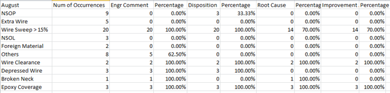

## XRay Data Consolidation
In TI's factory, there may be defected lots produced by machines. Each defected lot needs to be commented on by engineers to find out the reason behind the machine producing it. In order to do so, an online SharePointis maintained for engineers to comment. To track the progress, one engineer needs to manually check the SharePoint everyday. The goal of this project is to provide a script that scraps the table from SharePoint website and produce an easy-to-read Excel file for the responsible engineer to keep track of progress.

The script uses Selenium to scrap tables from SharePoint and uses Pandas to preprocess the data, then output it into an Excel file shown below:
 
 

 
 
